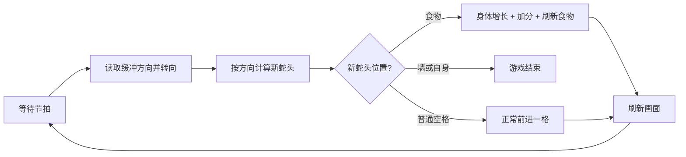

# 01 需求分析与设计思路

## 玩法规则（基线版）

1. 蛇在矩形网格上移动，每次移动占用一整格
2. 用方向键 / WASD 控制蛇头转向
3. 蛇不能掉头（不能直接反向 180°）
4. 场上随机刷新一个食物，蛇头碰到食物则吃掉：
   - 蛇身体 +1 格
   - 得分 +1
   - 场上重新生成新食物
5. 蛇撞到墙或撞到自己身体 → 游戏结束
6. 支持：重新开始、暂停/继续、显示当前分数
7. 加分项：记录最高分并本地保存

## 核心循环



游戏本质上是一个「**节拍驱动**」的循环：不是连续平滑移动，而是每隔固定时间（如 0.12s）走一步。节拍越快，蛇越快，难度越高。

## 需求拆解

| 模块 | 功能点 |
| --- | --- |
| 蛇 | 前进、转向（带防反向）、增长、自身碰撞判定 |
| 食物 | 随机生成且不压蛇身、被吃后刷新 |
| 场地 | 边界、墙碰撞判定（可扩展穿墙模式） |
| 流程 | 开始 / 游戏结束 / 重开 / 暂停 / 继续 |
| UI | 分数、最高分、状态提示（按任意键开始等） |
| 输入 | 键盘四方向，处理连续快速按键 |
| 打磨 | 音效、速度递增、头尾造型区分、最高分存档 |

## 总体设计思路

### 1. 用「整数网格坐标」而非像素坐标

- 蛇身每个部分用 `Vector2i`（如 `Vector2i(3, 5)`）记录它坐在第几行第几列
- 只有把坐标转成画面位置时才乘上「每格像素数」，例如 `Vector2i(3, 5) * 32`
- 好处：没有浮点误差、碰撞判定退化为「坐标比较」、方便实现「吃/增长」逻辑

### 2. 数据与显示分离

- **数据层**：一条蛇就是 `Array[Vector2i]` 身体段列表 + 一个方向
- **显示层**：根据这份数据把每一段画成方块/贴图
- 好处：逻辑好测、后期换皮肤或加动画不影响玩法代码

### 3. 用「头进尾出」模拟移动

身体移动 = **头朝方向插入一格 + 尾部去掉一格**（吃到食物时不掉尾）：

```text
身体: [H] [b1] [b2] [b3]
前进: 头部插入 → [newH] [H] [b1] [b2] [b3]，然后去掉末尾 [b3]
吃食物: 头部插入后不去掉尾巴 → 长度 +1
```

### 4. 用「下一方向缓冲」处理转向

玩家可能在两个节拍之间连续按多个方向。简单可靠的方案：**每个节拍只接受一次转向**，将按键存入「待处理方向」，节拍到达时校验「不能 180° 掉头」后应用。这能避免「本来向右、快速按上再按左」被误判成反向自杀。

### 5. 节拍驱动 vs 帧驱动

- 用 `Timer` 节点或自行累计 `delta` 来产生节拍
- 不要每帧都把蛇往前移一格，否则速度无法控制、且一次按键会连穿多格

## 开发路线（里程碑）

1. 搭出场景骨架 + 网格坐标常量
2. 让蛇能用定时器朝一个方向前进、可转向
3. 加入自身/边界碰撞与游戏结束
4. 加入食物生成、吃食物增长与计分
5. 完善流程：开始、暂停、重开、最高分存档
6. 打磨：速度递增、音效、造型、调参
