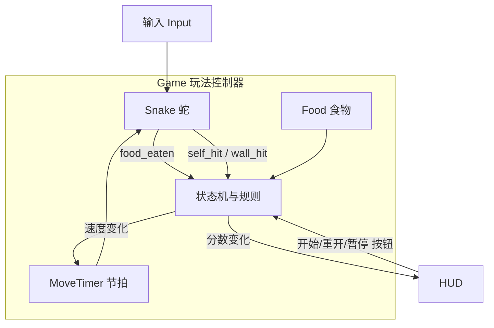

# 02 架构与模块设计

## 场景树结构

推荐「单主场景 + 组件节点」的结构，把逻辑拆到 `Game`（玩法）与 `HUD`（界面）两大块。

```text
Main.tscn                     # 游戏主场景（也是项目主场景）
├── Background                # ColorRect 或 ParallaxBackground，可选
├── Game (Node2D)             # 玩法逻辑层
│   ├── Snake (Node2D)        # 蛇的显示容器（身体段的父节点）
│   ├── Food (Node2D)         # 食物显示节点（可含 Area2D 或仅坐标）
│   └── MoveTimer (Timer)     # 节拍定时器，控制每次走一步的间隔
├── Walls (Node2D, 可选)       # 若有墙体障碍再引入
└── HUD (CanvasLayer)         # 始终置顶的 UI
    ├── ScoreLabel (Label)    # 当前分数
    ├── BestLabel (Label)     # 最高分
    └── CenterMessage (Label) # 开始 / 暂停 / 结束提示文字
```

信号流向大致为：`Main` 负责装配，`Snake` 对外发「吃到食物 / 撞死 / 撞墙」等信号，`Game` 监听后更新状态，`HUD` 负责纯展示。



## 目录结构建议

```text
res://
├── project.godot
├── icon.svg
├── Assets/
│   └── snake.png          # 现有素材
├── scenes/
│   ├── Main.tscn
│   └── Food.tscn          # 若食物作为独立场景复用
├── scripts/
│   ├── game.gd            # 玩法主控：状态机、规则、食物坐标管理
│   ├── snake.gd           # 蛇：身体数据、移动、转向、自身碰撞
│   ├── food.gd            # 食物：显示与位置同步
│   └── hud.gd             # 界面刷新与按钮
└── docs/                  # 本文档
```

## 常量与配置（集中在 game.gd 顶部）

```gdscript
## 场地网格尺寸（格数）
const GRID_W := 21
const GRID_H := 21
## 每格边长（像素）
const CELL := 24
## 初始移动间隔（秒）
const BASE_STEP := 0.14
## 每吃一个食物提速（秒，可减到下限）
const SPEED_UP := 0.004
const MIN_STEP := 0.06

## 方向表：四方向 → 网格增量
const DIRS := {
    Vector2i.UP:    Vector2i(0, -1),
    Vector2i.DOWN:  Vector2i(0, 1),
    Vector2i.LEFT:  Vector2i(-1, 0),
    Vector2i.RIGHT: Vector2i(1, 0),
}
```

把「网格坐标 → 像素坐标」封装成工具函数，全项目复用：

```gdscript
func grid_to_pixel(cell: Vector2i) -> Vector2:
    ## 把网格坐标换算成显示坐标（场地左上角为原点）
    return Vector2(cell) * CELL + Vector2(CELL, CELL) * 0.5
```

## 数据模型

### 蛇（snake.gd）

```gdscript
extends Node2D

signal food_eaten(head_cell: Vector2i)
signal game_over(reason: String)

var body: Array[Vector2i] = []     # body[0] 为蛇头
var pending_dir := Vector2i.RIGHT   # 下一节拍才生效的方向
var current_dir := Vector2i.RIGHT   # 当前实际移动方向

## 转向：只记录、不立即生效，且禁止 180° 掉头
func request_turn(dir: Vector2i) -> void:
    if dir == -current_dir or dir == current_dir:
        return
    pending_dir = dir

## 节拍回调：真正走一步
func step() -> void:
    current_dir = pending_dir
    var head := body[0] + current_dir
    body.push_front(head)          # 头进
    if not _will_eat(head):
        body.pop_back()            # 尾出
    # 同步显示：头部精灵移到 head，最后一个精灵移到被删除段的旧位置等
```

蛇身长度可能到达上百段，**每个节拍重建所有精灵较浪费**，推荐技巧：为每个身体段保留一个精灵节点，移动时把「队尾节点挪到新蛇头位置」环形复用，而不是反复 `instantiate/free`。

### 方向判断

屏幕坐标 `y` 向下为正，因此「向上」的网格增量是 `(0, -1)`，别写反。

## 状态机（game.gd）

```gdscript
enum State { READY, RUNNING, PAUSED, OVER }
var state: State = State.READY
```

| 状态 | 说明 | 触发 |
| --- | --- | --- |
| READY | 展示「按任意方向键开始」 | 玩家按方向键 → RUNNING |
| RUNNING | 正常游玩 | 撞墙/撞自己 → OVER；按 P → PAUSED |
| PAUSED | 暂停 | 按 P → RUNNING |
| OVER | 展示结束与最高分 | 按 R 或回车 → 重置为 READY |

暂停建议直接 `MoveTimer.stop()`，不要用 `get_tree().paused`，可避免 UI 卡顿问题（更简单可控）。

## 碰撞判定

在 `step()` 得到新蛇头后判断：

```gdscript
# 撞墙：越出网格范围
if head.x < 0 or head.y < 0 or head.x >= GRID_W or head.y >= GRID_H:
    game_over.emit("撞墙了")
# 撞自己：注意新头若与旧蛇身某段重合才算（排除旧尾，若它将被删掉则可安全经过）
if head in body.slice(0, -1):
    game_over.emit("咬到自己了")
```

细节坑：蛇头即将移入的格子如果是「旧尾所在格」，因为尾巴这一拍会被删掉，属于安全情况，判定时要排除最后一格。

## 食物（game.gd 或 food.gd）

生成逻辑：从「所有空格 − 蛇身占用」中随机选一格，保证不压蛇。

```gdscript
func spawn_food() -> void:
    var free: Array[Vector2i] = []
    for x in GRID_W:
        for y in GRID_H:
            var c := Vector2i(x, y)
            if c not in snake.body:
                free.append(c)
    food_cell = free.pick_random()
    food_node.position = grid_to_pixel(food_cell)
```

## 节拍与难度

```gdscript
# MoveTimer 每次超时发 timeout，Game 转给 snake.step()
# 吃掉食物后适当缩短 wait_time（注意 Timer 支持运行时改 wait_time）
move_timer.wait_time = maxf(BASE_STEP - eaten * SPEED_UP, MIN_STEP)
```

## 最高分存档

用 `FileAccess` 读写 `user://` 下的文本文件即可：

```gdscript
func load_best() -> int:
    if FileAccess.file_exists("user://best.txt"):
        return int(FileAccess.open("user://best.txt", FileAccess.READ).get_line())
    return 0

func save_best(v: int) -> void:
    var f := FileAccess.open("user://best.txt", FileAccess.WRITE)
    f.store_string(str(v))
```

## 显示方案说明

现有素材只有一张 `Assets/snake.png`（128 × 128）。实现阶段分两种处理：

1. **先用色块占位**：身体每段用 `ColorRect` 或 `Sprite2D`（程序生成的矩形图），蛇头用不同颜色/稍大一圈区分。先跑通玩法，再做美术。
2. **再决定贴图用法**：打开 `snake.png` 确认内容：
   - 若它是一格可复用的蛇头/蛇身素材 → 缩放到 `CELL` 大小作为每段贴图（蛇头单独处理）
   - 若它是完整一条蛇的成品图 → 不适合直接当单格贴图，可保留为游戏标题/图标，身体继续用色块，避免硬套
